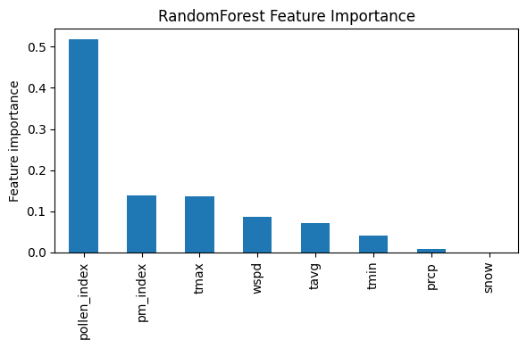
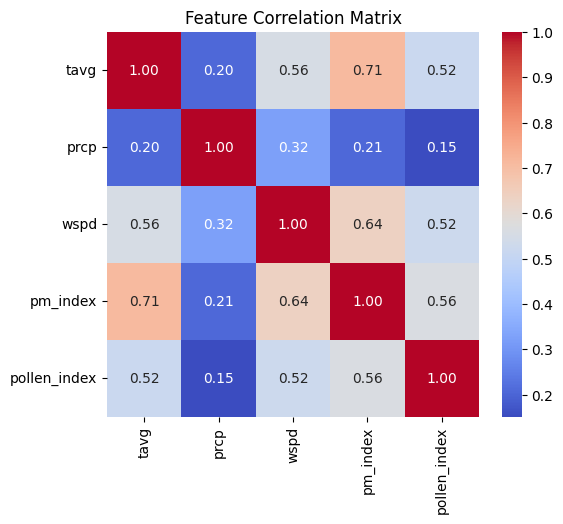
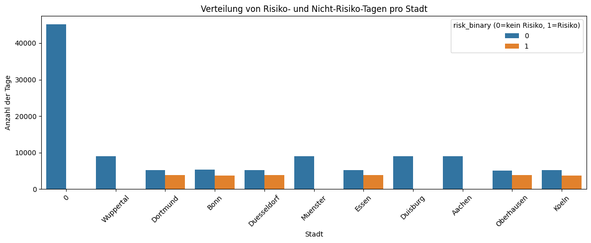

# 🌿 Allergy Risk Prediction (NRW)

Machine Learning project for predicting **daily allergy risk** in North Rhine-Westphalia cities using:

- 🌾 pollen data
- 🌫 air pollution (PM10)
- 🌦 weather data

The goal is to estimate the **risk level for people with allergies** based on environmental conditions.

---

# 📊 Data Sources

The model combines several environmental datasets:

• pollen levels  
• air pollution (PM10)  
• temperature and weather data  

Cities included:

- Essen
- Duisburg
- Dortmund
- Düsseldorf
- Bonn
- Köln
- Aachen
- Münster
- Oberhausen
- Wuppertal

---

# 🧠 Models Used

Two machine learning approaches were implemented:

### 🌳 Random Forest
A classical ensemble model used as the baseline.

### 🤖 Neural Network (PyTorch)
A small neural network trained to predict allergy risk probability.

---

# 📈 Model Performance

Random Forest achieved extremely high classification performance.

Example metrics:

Precision: ~0.99  
Recall: ~0.99  
Accuracy: ~0.99  

The neural network produced similar results.

---

# 🔬 Features Used

Main predictors:

- pollen_index
- pm_index
- temperature
- precipitation
- wind speed

Feature importance showed that **pollen levels are the strongest predictor**, followed by air pollution and temperature.

---

---

# Risk Distribution 

# 🔮 Forecasting

The model can also estimate **future allergy risk** for the next days based on recent environmental conditions.

Example forecast output:

| Date | City | Risk |
|-----|-----|-----|
| 2024-10-01 | Essen | High |
| 2024-10-02 | Essen | High |
| 2024-10-03 | Essen | High |

---

# ⚙️ Tech Stack

Python  
Pandas  
Scikit-Learn  
PyTorch  
Matplotlib  

---

# 📁 Repository Structure

allergy_risk_nrw

│

├── allergy_risk_model.ipynb

├── README.md

├── requirements.txt

├── assets

├── plots

├── images

---

# 👩‍💻 Author

Created as a Data Science project exploring environmental health prediction models.
---

# How to run the project

Clone the repository:

git clone https://github.com/Lidpvs/allergy_risk_nrw.git

Install dependencies:

pip install -r requirements.txt

Open the notebook:

allergy_risk_prediction.ipynb

---

# Key Insights

• Pollen index is the strongest predictor of allergy risk  
• Air pollution (PM10) significantly increases risk  
• Weather variables (temperature and wind) also contribute  
• Neural networks and Random Forest achieve similar performance

---

# Project Goal

This project explores how environmental data can be used to estimate allergy risk and help people prepare for high-pollen days.
